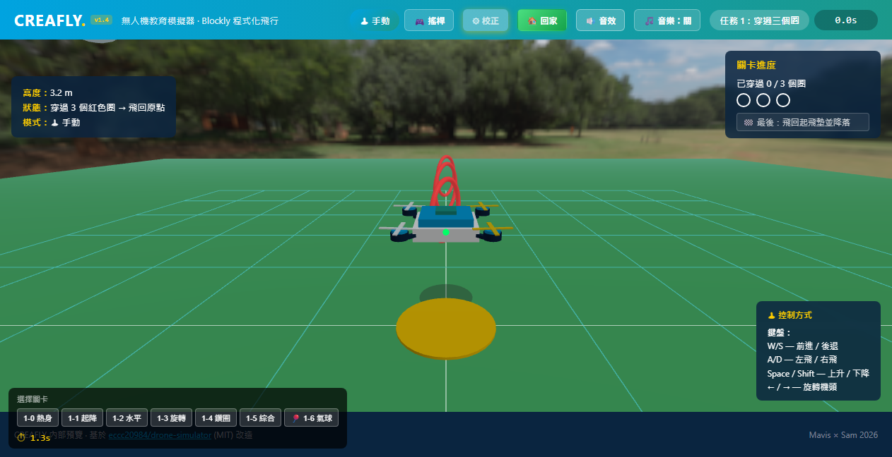
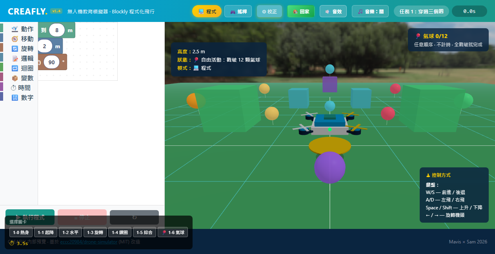
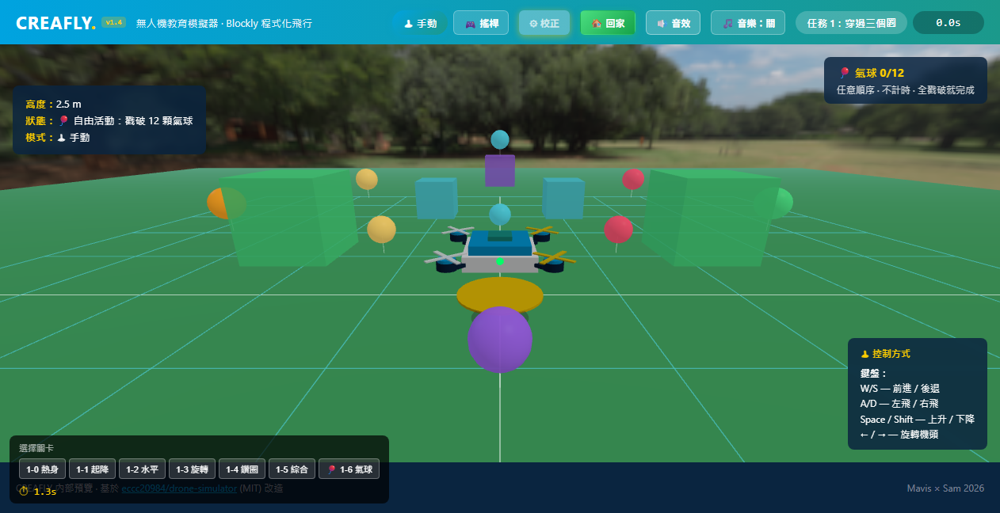
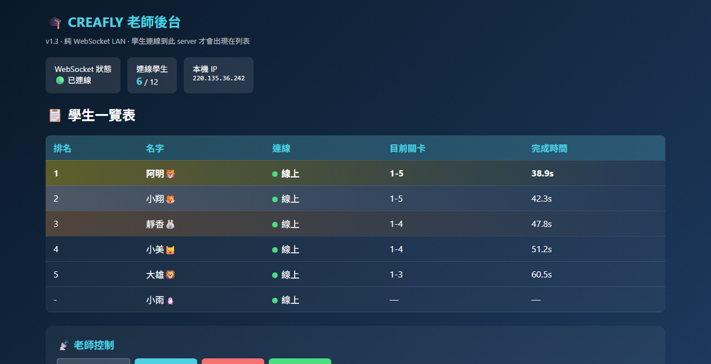

# 🚁 CREAFLY 無人機教育模擬器

> 台灣 K-12 程式教育用的**瀏覽器無人機飛行模擬器** —
> 手動操控 + Blockly 視覺化程式 + 老師即時後台,零安裝、零 build,打開網址就能飛。



**🎮 線上試玩:** <https://droneclassroom-production.up.railway.app>
( 學生端 `/` ·　老師後台 `/teacher` )

---

## ✨ 特色

- **🕹 雙模式操控** — 手動(鍵盤／觸控搖桿／實體遊戲手把)與 **Blockly 視覺化程式**一鍵切換。
- **🎯 漸進式關卡** — 從搖桿熱身、垂直起降、水平移動、旋轉,到鑽圈、飛回起飛墊降落。
- **🎈 氣球自由活動** — 在天空收集 12 顆不同高度的氣球,還要繞過實心方塊障礙,訓練綜合操控。
- **🧑‍🏫 老師即時後台** — 學生上線狀態、目前關卡、完成時間**即時排行**;可一鍵廣播「載入關卡／重置／開始比賽」。同名自動視為重連,名單不會堆積幽靈。
- **🌅 真實遠景 + 背景音樂** — CC0 HDRI 天空盒增加縱深,內建可開關的背景音樂。
- **📱 跨裝置** — 桌機鍵盤、平板／手機 nipplejs 觸控搖桿、USB／藍牙遊戲手把(附校正精靈)。
- **⚡ 零 build** — 純靜態檔 + Three.js／Blockly CDN,`node server.js` 即可跑;WebSocket 與 HTTP 共用單一 port,雲端一鍵部署。

## 📸 畫面

| 程式模式(Blockly 積木) | 氣球自由活動 |
|---|---|
|  |  |

**老師即時後台 —— 學生進度 / 完成時間即時排行:**



## 🚀 快速開始(本機)

需要 Node.js 18+。

```bash
git clone https://github.com/pc0808f/droneclassroom.git
cd droneclassroom
npm install        # 只裝一個相依套件：ws（WebSocket）
node server.js     # 啟動於 http://localhost:3000
```

- **學生端:** <http://localhost:3000/>
- **老師後台:** <http://localhost:3000/teacher>

> 沒有 build / bundler / TypeScript。Three.js、Blockly、nipplejs 都從 CDN 載入,改檔後重新整理瀏覽器即可(伺服器送 no-cache)。

## 🎮 操作方式

預設為標準 Mode 2 搖桿配置(手動模式):

| | 左搖桿 | 右搖桿 |
|---|---|---|
| **觸控／實體搖桿** | 上下＝升降 ·　左右＝旋轉(偏航) | 上下＝前進／後退 ·　左右＝左飛／右飛 |
| **鍵盤** | `Space`／`Shift`＝升／降 ·　`←`／`→`＝旋轉 | `W`／`S`＝前後 ·　`A`／`D`＝左右 |

切到**程式模式**後,用 Blockly 積木組合動作(起飛、移動、旋轉、迴圈、計時…)再按「▶ 執行程式」。

## 🗺️ 關卡(第一章 · 新手村)

| 關卡 | 名稱 | 練習重點 |
|---|---|---|
| 1-0 | 搖桿熱身 | 自由推桿熟悉手感 |
| 1-1 | 垂直起降 | 油門控高(起飛→3m→1m→落地,**依序判定**) |
| 1-2 | 水平移動 | 前後左右四方向,飛出去再回原點 |
| 1-3 | 旋轉 | 旋轉到 4 個方位 |
| 1-4 | 鑽第一個圈 | 穿過 3 個紅圈 → **飛回起飛墊降落**才過關 |
| 1-5 | 旋轉鑽圈 | 旋轉 + 鑽圈綜合 → 飛回降落 |
| 1-6 | 🎈 氣球大冒險 | 自由活動:任意順序戳破 12 顆氣球、繞過實心方塊 |

> 關卡是**純資料**(`levels/chapter1.json`):用 `rings`(鑽圈)、`passZones`(分步過關偵測)、`balloons`(收集)、`obstacles`(障礙)描述,改關卡不需要動程式碼。

## 🏗️ 架構

三個檔案幾乎就是全部,沒有打包步驟:

```
droneclassroom/
├── index.html          # 學生端單頁 App（全部 UI + CSS）
├── main.js             # 核心（~3000 行，分區註解）：
│                       #   Three.js 場景 + 自寫物理 + HDRI 天空
│                       #   手動控制（鍵盤 / nipplejs 觸控 / Gamepad API + 校正）
│                       #   手動 ↔ 程式 模式切換
│                       #   Blockly 整合 + cf_* 動作 API（async 序列執行）
│                       #   關卡載入、過關判定、HUD、學生端 WebSocket client
├── teacher.html        # 老師後台（學生名單 / 排行 / 廣播控制）
├── server.js           # Node http 靜態伺服器 + ws WebSocket（共用同一 port）
├── levels/chapter1.json# 關卡資料
└── assets/             # HDRI 天空（CC0）、背景音樂（CC BY）
```

**幾個關鍵概念**

- **`cf_*` 動作 API** 是 Blockly 產生的程式碼與模擬器之間的合約(`cf_takeoff`／`cf_forward`／`cf_rotateClockwise`…),都是 `async`,逐步驅動 `droneState`。新增積木 = 對應一個 `cf_*` 函式。
- **手動 ↔ 程式** 是核心分流:手動模式由搖桿直接驅動;程式模式由 Blockly 程式驅動,兩者互斥。
- **關卡即資料**:`fetch('levels/chapter1.json')` 後動態載入,過關偵測讀 `passZones` / `rings` / `balloons`。
- **WebSocket** 用 URL path 區分角色(`/` 學生、`/teacher` 老師),狀態全在記憶體;與 HTTP 共用同一個 port,方便雲端部署。

## 🧰 技術棧

- **3D 渲染:** [Three.js](https://threejs.org/) 0.162(CDN)＋ RGBELoader HDRI 天空
- **視覺化程式:** [Blockly](https://developers.google.com/blockly) 10.4.3(CDN)
- **觸控搖桿:** [nipplejs](https://github.com/yoannmoinet/nipplejs) 0.10.2
- **物理 / 音效:** 自寫(Web Audio API 生成音效)
- **伺服器:** Node.js + [ws](https://github.com/websockets/ws)(WebSocket)
- **無** build step ·　**無** bundler ·　**無** TypeScript

## ☁️ 部署(Railway)

本專案已 Railway-ready(WebSocket 與 HTTP 共用 `process.env.PORT`):

1. [Railway](https://railway.app) → **New Project → Deploy from GitHub repo** → 選本 repo
2. 自動偵測 Node(Nixpacks)→ `npm install` + `npm start`,**不需任何設定檔**
3. Settings → Networking → **Generate Domain** 取得網址
4. 學生開 `/`、老師開 `/teacher`
5. ⚠️ **Replicas 維持 1**(學生名單在記憶體,多副本會狀態分裂)

## 📄 素材授權

程式碼為 MIT。`assets/` 內的素材保留各自的 Creative Commons 授權(HDRI 天空 CC0、背景音樂 CC BY 4.0),詳見 [`docs/ATTRIBUTIONS.md`](docs/ATTRIBUTIONS.md)。

## License

MIT(fork 自 [eccc20984/drone-simulator](https://github.com/eccc20984/drone-simulator))
